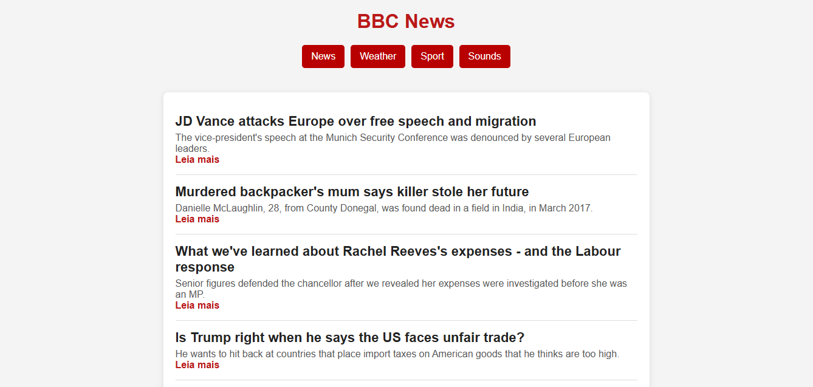
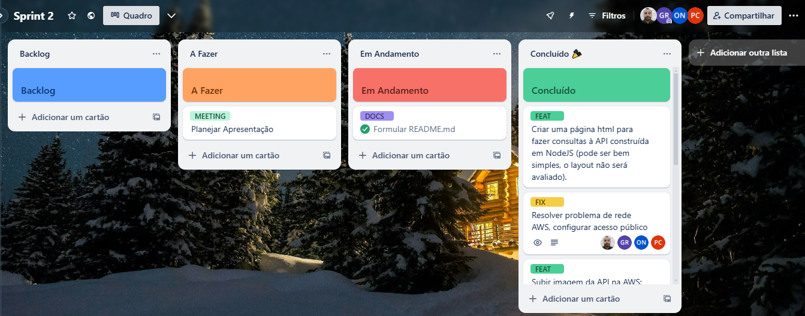
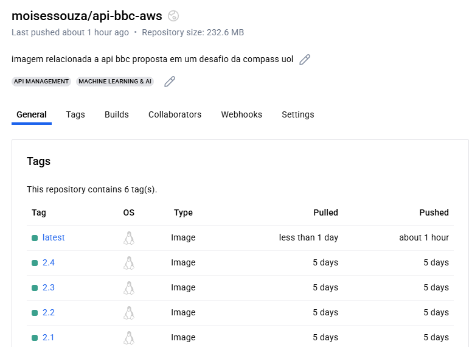

# 🎯 Objetivo:  API Feed RSS em uma instância AWS EC2 

Uma API que fornece notícias vindas de um feed RSS da [BBC News](https://www.bbc.com/news), desenvolvida para a avaliação das sprints 2 e 3 para formação em Inteligência Artificial para AWS.



## Rotas

- ``GET /``: Retorna um layout intuitivo que permite consultar notícias e filtrar por tópicos e subtópicos.
- ``GET /api``: Retorna um objeto JSON correspondente ao feed RSS.

## Infraestrutura

A API foi desenvolvida com Express.js, em NodeJS. Ela roda em Docker e interage com um bucket S3, para armazenamento de dados. A versão disponível on-line roda em uma instância EC2. 

# 🌐 Informações de Acesso

## Acesso pela URL
O sistema pode ser acessado pelo seguinte endereço:  
🌍🔗 [http://34.206.54.166/](http://34.206.54.166/)  

⚠ **Importante:**  
Para não gerar gastos adicionais, não foi utilizado um **IP Elástico**. Com isso, o endereço IP pode mudar caso a instância seja reiniciada.

## 🛠 Instalando e Rodando com Infraestrutura AWS, com Docker

O servidor pode ser rodado localmente por meio do comando `docker-compose up` . Para isso, é necessário que haja um arquivo .env, com as variáveis de ambiente apropriadas. Pode-se consultar o arquivo *.env.example.*

1. Faça o download do repositório.
2. Atualize, se for o caso, o que for necessário na API. Isso pode ser desde a implementação de uma nova funcionalidade à modificação de variáveis de ambiente.
3. Faça o build de uma nova imagem, rodando `docker build -t <repositorioEmDockerHub> .` na pasta do projeto.
4. Faça o login em sua conta do DockerHub com `docker login` .
5. Faça o push da imagem com `docker push <nomeDaImagem>` .
6. Faça o logout, se desejado, com `docker logout` .
7. Acesse a instância EC2 pela forma desejada, como por SSH. 
Exemplo: `ssh -i "teste-api.pem" ec2-user@34.206.54.166`.
8. Crie um arquivo bash e dê a ele acesso de execução: `touch script.sh | chmod +x script.sh`
9. Será necessário editar o arquivo script.sh(``nano script.sh``), copiar e colar todas as linhas do script.sh da raíz do projeto no arquivo que está sendo editado.
10. Execute o script e veja a mágica do pipeline acontecer: `./script.sh`

# 🛠 Como Utilizo Este Sistema?

## 🚀 Acesso  
Para acessar o sistema, o usuário deve navegar até o endereço:  
🔗 [http://34.206.54.166/](http://34.206.54.166/)  


## ⚡ Funcionalidades  

### Após o carregamento, o usuário visualizará:  

- **Opções de filtragem** (localizadas no topo da tela)  
  - Permitem a categorização do conteúdo por **tópico** e **subtópico**.  

- **Lista de matérias** (exibida abaixo das opções de filtragem)  
  - Título da matéria.  
  - Resumo do conteúdo.  
  - Link para redirecionamento ao site da matéria completa.  

# 👥 Organização da Equipe

## 🗂 Forma de Organização  

Para planejamento e acompanhamento do progresso, utilizamos a ferramenta **[Trello](https://trello.com/b/hKafgooT/sprint-2)**, seguindo a metodologia **Kanban**.  



### Metodologia de Trabalho  
  -  Foram realizadas reuniões diárias via Microsoft Teams para o desenvolvimento do código e configuração dos serviços da **AWS**.  
  - O fluxo de trabalho foi organizado em etapas.  


## 🏆 Divisão de Tarefas

Durante o desenvolvimento e planejamento, não houve uma divisão rígida de atribuições. No entanto, as responsabilidades podem ser organizadas da seguinte forma:  

- **Moisés**: Imagem docker e Integração da API com os serviços da AWS.  
- **Guilherme**: Estruturação e desenvolvimento da API.  
- **Paulo**: Desenvolvimento e organização do Front-end.  
- **Osvaldo**: Ajustes e documentação. 


## 📂 Estruturação de Pastas

A estruturação de pastas da API teve como base alguns princípios de Domain Driven Design (DDD), com uma divisão em 3 camadas:


```	
# Estrutura do Projeto

├── 📁src                                          # Diretório raiz do código fonte  
│   ├── 📁Domain                                   # Camada de domínio/regras de negócio  
│   │   ├── 📁Interfaces                           # Interfaces/contratos do sistema  
│   │   │   ├── 📄IRSSHandler.js                   # Interface para manipulação de RSS  
│   │   │   └── 📄IService.js                      # Interface genérica para serviços  
│   │   └── 📁Services                             # Implementações de serviços  
│   │       ├── 📄GetFeedBBCService.js             # Serviço para buscar feed BBC  
│   │       ├── 📄GetFeedS3Service.js              # Serviço para obter feed do S3  
│   │       ├── 📄GetFilteredFeedS3Service.js      # Serviço para feed filtrado do S3  
│   │       └── 📄UpdateFeedS3Service.js           # Serviço para atualizar feed no S3  
│   ├── 📁Infra                                    # Camada de infraestrutura  
│   │   ├── 📁RSSHandler                           # Implementações relacionadas a RSS  
│   │   │   └── 📄rss-parser.js                    # Parser de RSS  
│   │   └── 📁Repository                           # Repositórios de dados  
│   │       └── 📄S3Repository.js                  # Repositório para interação com Amazon S3  
│   └── 📁Presentation                             # Camada de apresentação  
│       ├── 📁Controllers                          # Controladores da aplicação  
│       │   └── 📄get-feed-controller.js           # Controlador para obter feeds  
│       └── 📁Public                               # Arquivos estáticos públicos  
│           ├── 📁JS                               # Scripts JavaScript  
│           │   ├── 📁Display                      # Códigos de exibição  
│           │   │   ├── 📄displayNews.js           # Exibe notícias na UI  
│           │   │   ├── 📄displaySubtopics.js      # Exibe subtópicos  
│           │   │   └── 📄displayTopics.js         # Exibe tópicos principais  
│           │   ├── 📁Fetch                        # Códigos para busca de dados  
│           │   │   ├── 📄fetchNews.js             # Busca notícias via API  
│           │   │   └── 📄loadTopics.js            # Carrega tópicos salvos  
│           │   └── 📄scripts.js                   # Scripts gerais da aplicação  
│           ├── 📁Utilities                        # Utilitários diversos  
│           │   └── 📄api-url.js                   # Configura URLs da API  
│           ├── 📄index.html                       # Página principal do frontend  
│           └── 📄styles.css                       # Estilos globais  
├── 📄.dockerignore                                # Ignora arquivos no Docker  
├── 📄.gitignore                                   # Ignora arquivos no Git  
├── 📄.env                                         # Variáveis de ambiente (sensíveis)  
├── 📄.env.example                                 # Exemplo de variáveis de ambiente  
├── 📄docker-compose.yml                           # Configuração do Docker Compose  
├── 📄dockerfile                                   # Instruções de build do Docker  
├── 📄index.js                                     # Ponto de entrada da aplicação  
├── 📄package-lock.json                            # Lock de dependências npm  
├── 📄package.json                                 # Metadados e dependências do projeto  
├── 📄README.md                                    # Documentação do projeto  
├── 📄router.js                                    # Configuração de rotas da aplicação  
└── 📄script.sh                                    # Script deploy automation da api no ec2    
```	

## 📂 Versionamento das imagens criadas no docker hub:

Utilizamos boas práticas de versionamento e utilizamos imagem docker para facilitar o deploy da aplicação na instância do EC2:




# 📦 Configuração de um Bucket S3

## 🛠️ Criação do Bucket

## 🔒 Configuração de Permissões

### 📌 Política do Bucket
  - Permissão s3:GetObject
  - Permissão s3:PuObject
  

# ☁️ Serviços da AWS: VPC e Instância EC2  

## 🏗 Configurações da VPC  

###  Criar uma Nova VPC  .  

###  Criar uma Subnet Pública  
- Associar à **VPC criada**.   

###  Criar um Internet Gateway  
- Criar e anexar à **VPC** para permitir acesso externo.  

###  Configurar Tabela de Rotas  
- Criar uma **tabela de rotas pública**.  
- Adicionar rota para **0.0.0.0/0** via **Internet Gateway**.  
- Associar à **Subnet Pública**.  


## 💻  Configurações da Instância EC2  

###  Escolher o Tipo de Instância  
- **`t2.micro`** (elegível para o Free Tier).  

### Configuração da Rede  
- Associar à **VPC criada**.  
- Selecionar a **Subnet Pública**.  

### Configuração do Grupo de Segurança (Security Group)  
Definir regras de acesso:  
- 🔑 **SSH (22)** → Origem: **IP do usuário**.  
- 🌍 **HTTP (80)** → Origem: **Tráfego público**.  
- 🔒 **HTTPS (443)** → Origem: **Tráfego público**.  

---

# 🚧 Desafios

## Autenticação da API com a AWS  
### Problema  
- Configuração de autenticação da API utilizando *Access Key*.  

### Solução  
- Ajuste na estrutura de configuração do `S3Client`, garantindo a utilização do método atual para autenticação.  

## Utilização da URL no Front-end  
### Problema  
- Falha no acesso à URL definida no arquivo `.env` via `dotenv` pelo front-end.  

### Solução  
- Armazenamento da URL em uma constante isolada.  
- Uso do módulo *File System* para criar ou sobrescrever dinamicamente o arquivo de configuração, mantendo-o sempre sincronizado com o `.env`.  

## Conexão da EC2 com a rede  
### Problema  
- Falta de conexão entre a instância EC2 e o ambiente externo.  

### Solução  
- Configuração da *VPC* para garantir tráfego adequado via *SSH* e *HTTP*, permitindo comunicação com a rede.  

## Configuração do Linux e Docker na EC2  
### Problema  
- Configuração e atualização manual de cada etapa.  

### Solução  
- Criação de um *script.sh* para automatizar o processo, reduzindo erros e tempo de configuração. O arquivo se encontra na raíz do projeto.

# 👨‍💻 Autores

- Moisés
- Guilherme
- Paulo
- Osvaldo
